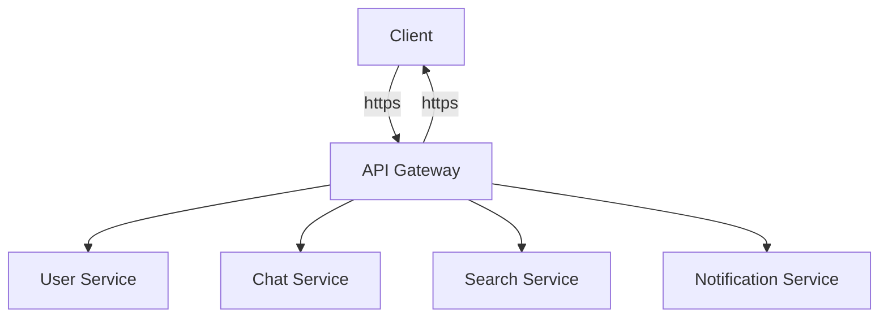

# Realtime Chat
A full-stack project that delivers low-latency messaging, real-time presence tracking,
and a responsive user interface. Designed to handle millions of users, it showcases my
expertise in full-stack development and modern system design.

## 🎉 Core Features

- **Real-Time Messaging**
   - **Kafka**: Acts as the message broker for high-throughput, low-latency message delivery.
   - **Redis**: Caches recent messages for fast retrieval by connected users.
   - **PostgreSQL**: Stores metadata about messages (e.g., sender, timestamp) for structured querying.

- **Message Persistence**
   - **Kafka**: Persists messages in a durable log for long-term storage and replayability.
   - **Redis**: Stores recent messages in memory for quick access.
   - **PostgreSQL**: Maintains a structured history of messages for auditing and analytics.

- **Scalability**
   - **Kafka**: Scales horizontally to handle millions of messages per second.
   - **Redis**: Reduces database load by caching frequently accessed data.
   - **PostgreSQL**: Scales vertically and supports partitioning for large datasets.

- **Message Ordering**
   - **Kafka**: Guarantees message order within partitions for consistent delivery.
   - **Redis**: Maintains the sequence of messages in chat rooms using sorted sets.
   - **PostgreSQL**: Stores message metadata to ensure consistency in message ordering.

- **File Transfer**
    - **Kafka**: Handles metadata and events for file uploads and downloads.
    - **Redis**: Caches file metadata and temporary upload links for fast access.
    - **PostgreSQL**: Stores file metadata, access permissions, and download history.

- **User Authentication**
    - **Kafka**: Streams authentication events (e.g., login/logout) for real-time updates.
    - **Redis**: Stores session tokens and temporary authentication data for low-latency access.
    - **PostgreSQL**: Manages user credentials, roles, and permissions securely.

- **Presence & Online Status**
   - **Kafka**: Streams presence updates (e.g., online/offline) in real-time.
   - **Redis**: Tracks user presence with low-latency in-memory storage.
   - **PostgreSQL**: Stores historical presence data for analytics and reporting.

- **Push Notifications**
   - **Kafka**: Triggers notifications for offline users when new messages arrive.
   - **Redis**: Stores user notification preferences and device tokens for quick access.
   - **PostgreSQL**: Manages notification settings and delivery logs.

- **Message Acknowledgment**
   - **Kafka**: Tracks message delivery and consumption status.
   - **Redis**: Stores read receipts and acknowledgment status for real-time updates.
   - **PostgreSQL**: Logs acknowledgment history for auditing and analytics.

- **Group Chats & Channels**
   - **Kafka**: Uses topics to represent group chats and broadcast messages to members.
   - **Redis**: Stores metadata about group members, roles, and permissions.
   - **PostgreSQL**: Manages group memberships and permissions in a structured way.

- **Message Search**
   - **Kafka**: Indexes messages for advanced search capabilities (e.g., via Elasticsearch).
   - **Redis**: Caches frequently searched messages or metadata for faster retrieval.
   - **PostgreSQL**: Enables structured querying of message metadata (e.g., by sender or timestamp).

- **Rate Limiting**
    - **Kafka**: Decouples rate-limiting logic from the chat service for scalability.
    - **Redis**: Implements rate limiting using counters and time-windowed data structures.
    - **PostgreSQL**: Stores rate-limiting rules and historical data for analysis.

**💪 Key Strengths Demonstrated:**
- **Kafka**: Scalable, real-time event streaming and message brokering.
- **Redis**: Low-latency caching, real-time presence tracking, and session management.
- **PostgreSQL**: Structured data storage, ACID compliance, and advanced querying.

## Frontend
Built with **React - TypeScript** for robust type safety, enhanced by **Zustand** for efficient
state management and styled with **Material UI** for a sleek, responsive UI - every interaction
feels effortless and visually captivating.

## Backend

### Microservices Architecture

### Core Microservices
- **User Service**
	- User registration, authentication and profile management.
	- JWT token generation and validation.
	- Password reset and account recovery.
	- User preferences and settings.
	- Third-party identity providers integration

- **Chat service**: manages chat messages and real-time communication.
	- Core message handling (sending, receiving, storing)
	- Message delivery tracking (sent, received, read)
	- Message persistence.
	- Read/unread status (Read Receipts)

- **Search Service**: provides search functionality to enable users to find specific messages,
conversations, or files efficiently.
	- Message history search.
	- Keyword and advanced filters search.

- **Presence Service**: is responsible for tracking live user activity. It ensures real-time
updates are available to other users in the chat.
	- Online/offline status tracking.
	- Last seen information.
	- Typing indicators.

- **Notification service**
	- Push notifications for new messages.
	- Email/SMS alerts.
	- In-app notifications.
	- Notification preferences.

- **Media service**
	- File uploads/sharing management.
	- File validation and Enforce size limitations and validate file types.
	- Serve images via CDN.
	- Malware scanning.

### API Gateway

<!-- Contact/Relationship Service

Managing user contacts/friends lists

Handling friend requests and blocking

Following/unfollowing other users -->

<!-- Channel/Group Service

Group chat creation and management

Channel permissions and roles

Topic-based channels (for communities) -->

### Workflow

