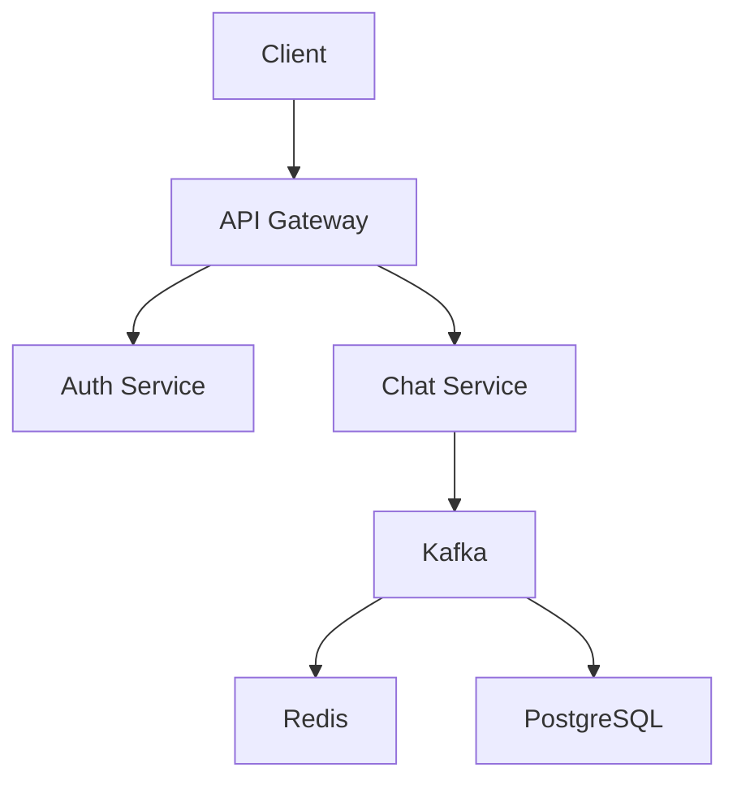

# Realtime Chat
An ultimate full-stack project built with a **Modular Monolith** architecture, utilizing:
- **React/TypeScript** | **Material UI** for the front end.
- **Kafka** | **Redis** | **PostgreSQL** for backend services.

It delivers low-latency messaging, real-time presence tracking, and a responsive user interface.
Designed to handle millions of users, it showcases my expertise in full-stack development and modern system design.

## 🎉 Core Features

- **Real-Time Messaging**
   - **Kafka**: Acts as the message broker for high-throughput, low-latency message delivery.
   - **Redis**: Caches recent messages for fast retrieval by connected users.
   - **PostgreSQL**: Stores metadata about messages (e.g., sender, timestamp) for structured querying.

- **Message Persistence**
   - **Kafka**: Persists messages in a durable log for long-term storage and replayability.
   - **Redis**: Stores recent messages in memory for quick access.
   - **PostgreSQL**: Maintains a structured history of messages for auditing and analytics.

- **Scalability**
   - **Kafka**: Scales horizontally to handle millions of messages per second.
   - **Redis**: Reduces database load by caching frequently accessed data.
   - **PostgreSQL**: Scales vertically and supports partitioning for large datasets.

- **Message Ordering**
   - **Kafka**: Guarantees message order within partitions for consistent delivery.
   - **Redis**: Maintains the sequence of messages in chat rooms using sorted sets.
   - **PostgreSQL**: Stores message metadata to ensure consistency in message ordering.

- **File Transfer**
    - **Kafka**: Handles metadata and events for file uploads and downloads.
    - **Redis**: Caches file metadata and temporary upload links for fast access.
    - **PostgreSQL**: Stores file metadata, access permissions, and download history.

- **User Authentication**
    - **Kafka**: Streams authentication events (e.g., login/logout) for real-time updates.
    - **Redis**: Stores session tokens and temporary authentication data for low-latency access.
    - **PostgreSQL**: Manages user credentials, roles, and permissions securely.

- **Presence & Online Status**
   - **Kafka**: Streams presence updates (e.g., online/offline) in real-time.
   - **Redis**: Tracks user presence with low-latency in-memory storage.
   - **PostgreSQL**: Stores historical presence data for analytics and reporting.

- **Push Notifications**
   - **Kafka**: Triggers notifications for offline users when new messages arrive.
   - **Redis**: Stores user notification preferences and device tokens for quick access.
   - **PostgreSQL**: Manages notification settings and delivery logs.

- **Message Acknowledgment**
   - **Kafka**: Tracks message delivery and consumption status.
   - **Redis**: Stores read receipts and acknowledgment status for real-time updates.
   - **PostgreSQL**: Logs acknowledgment history for auditing and analytics.

- **Group Chats & Channels**
   - **Kafka**: Uses topics to represent group chats and broadcast messages to members.
   - **Redis**: Stores metadata about group members, roles, and permissions.
   - **PostgreSQL**: Manages group memberships and permissions in a structured way.

- **Message Search**
   - **Kafka**: Indexes messages for advanced search capabilities (e.g., via Elasticsearch).
   - **Redis**: Caches frequently searched messages or metadata for faster retrieval.
   - **PostgreSQL**: Enables structured querying of message metadata (e.g., by sender or timestamp).

- **Rate Limiting**
    - **Kafka**: Decouples rate-limiting logic from the chat service for scalability.
    - **Redis**: Implements rate limiting using counters and time-windowed data structures.
    - **PostgreSQL**: Stores rate-limiting rules and historical data for analysis.

**💪 Key Strengths Demonstrated:**
- **Kafka**: Scalable, real-time event streaming and message brokering.
- **Redis**: Low-latency caching, real-time presence tracking, and session management.
- **PostgreSQL**: Structured data storage, ACID compliance, and advanced querying.

## Backend Design

> You shouldn't start a new project with microservices, even if you're sure your
> application will be big enough to make it worthwhile.
> -- [Martin Fowler](https://en.wikipedia.org/wiki/Martin_Fowler_(software_engineer))

### Architecture

**Modular Monolith (MM)** is a software architecture that structures the application
as a single deployment unit (like a traditional monolith) but organizes its internal
modules in such a way that they are loosely coupled and highly cohesive. Each module
within the architecture focuses on a specific business domain or functionality,
similar to how microservices operate, but without the distributed system complexity.
This modular design enables seamless extraction of individual module into an independent
(micro)service in the future, should the need arise for greater scalability or distribution.

**Modular Monolith First**: Diving straight into microservices can be fraught with
challenges due to its inherent [complexities]().
This approach often leads to a scattered system that requires significant logistical
effort to glue components together, potentially diverting you from your primary goal:
delivering the core functionality your software is intended to provide. Instead, begin
with a **MM** that adheres to these
[principles](https://gist.github.com/hoangfin/bb291665748466f456f18fa8db648419).

One common misunderstanding when discussing a **MM** is the assumption that it runs on a single
server and therefore "cannot scale." In reality, a well-architected **MM** can run on multiple
servers behind a load balancer, utilize database replicas (slaves) for read operations, and
still be deployed and operated as a single unit. It scales effectively, often far beyond
what is typically assumed 👏.

### System Design Flow
Message Sending Example Flow:

Frontend: React client sends message via WebSocket to Node.js gateway.

Node.js:
Authenticates message (JWT).
Publishes to Kafka topic: chat.message_sent.

Node.js Backend (Modular Monolith):
Kafka consumer picks up event.
Validates & persists to PostgreSQL.
Emits delivery confirmation via Kafka: chat.message_delivered.

Node.js:
Subscribed to chat.message_delivered, forwards it via WebSocket to clients.

4. Tech Stack Roles
Component	Tech	Purpose
Frontend	React + TS	UI, WebSocket client
Real-time Gateway	Node.js	WebSocket server, Kafka producer/consumer
Backend Core	Node.js	Business logic, REST APIs, Kafka consumers, PostgreSQL
Database	PostgreSQL	Persistent storage (messages, users, chats)
Cache/Presence	Redis	Presence tracking, caching user sessions
Messaging Bus	Kafka	Event bus for decoupled communication
Deployment	Docker + K8s	Scalability, container orchestration
Modules (Bounded Contexts) – DDD Focus

### Project Structure

| Component     | Description                                                                 |
|---------------|-----------------------------------------------------------------------------|
| `controller`  | Exposes APIs (REST/WebSocket) to frontend                                   |
| `service`     | Business logic (save messages, notify users, etc.)                         |
| `event`       | Kafka consumers for message events                                         |
| `repository`  | PostgreSQL access (via Spring Data JPA)                                    |
| `model`       | Entities mapped to DB (e.g., Message)                                      |
| `dto`         | Data Transfer Objects (incoming/outgoing data)                             |
